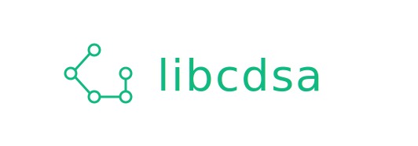

> [!WARNING]
> This library is currently a work in progress. It is experimental and may be unstable — use it at your own risk.

---

# Data Structures and Algorithms Library in C

---

## Table of Contents

- [Overview](#overview)
  - [Features](#features)
  - [Limitations](#limitations)
  - [Technologies](#technologies)
- [Getting Started](#getting-started)
    - [Prerequisites](#prerequisites)
    - [Installing](#installing)
    - [Usage](#usage)
    - [Documentation](#documentation)
    - [Building](#building)
    - [Tests](#tests)
    - [Installing System-Wide](#installing-system-wide)
- [Contributing](#contributing)
- [License](#license)

---

## Overview

A Feature-Rich, High-Level, and Easy-to-Use Data Structures and Algorithms Library for the C programming language.

This project provides common data structures and algorithms with clean, expressive, and
reusable abstractions — bringing a modern programming experience to C.
It includes implementations of widely used data structures such as array lists, linked lists, hash maps, and hash sets,
along with classic algorithms like merge sort and quick sort. The API is heavily inspired by the 
Java Collections Framework, offering a familiar interface for developers with a Java background.

---

### Features

The library currently provides the following data structures:

- [Array List](src/list/array_list.h): A dynamic, linear structure that stores elements contiguously in memory for fast random access.
- [Linked List](src/list/linked_list.h): A dynamic, linear structure that stores elements in non-contiguous memory, linked by references.
- [Hash Map](src/map/hash_map.h): An unordered associative structure mapping unique keys to values using a hash function.
- [Tree Map](src/map/tree_map.h): An ordered associative structure mapping unique keys to values, backed by a binary search tree.
- [Hash Set](src/set/hash_set.h): An unordered structure storing unique elements with hash-based lookup.
- [Tree Set](src/set/tree_set.h): An ordered structure storing unique elements in a sorted manner, backed by a binary search tree.
- [Deque](src/deque/deque.h): A linear structure allowing insertion and removal at both ends of the sequence.
- [Stack](src/stack/stack.h): A linear LIFO structure where elements are inserted and removed from the top.
- [Queue](src/queue/queue.h): A linear FIFO structure where elements are added at the rear and removed from the front.
- [Priority Queue](src/priority_queue/priority_queue.h): ...

Also, there is some other utilities which may be useful:

- [Sets](src/set/sets.h): Common mathematical set operations and set view abstraction.
- [Algorithms](src/util/algorithms.h): Algorithms related enumerations.
- [Collection](src/util/collection.h): Collection view abstraction.
- [Constraints](src/util/constraints.h): Pre-condition checks.
- [Errors](src/util/errors.h): Built-in custom error handling system used by the library.
- [For Each](src/util/for_each.h): For Each macro abstraction to iterate through collections.
- [Functions](src/util/functions.h): Functions typedefs and default implementations.
- [Iterator](src/util/iterator.h): Fully generic iterator abstraction.
- [Memory](src/util/memory.h): Memory management abstractions.
- [Optional](src/util/optional.h): Container type which may or may not contain a value.
- [Pair](src/util/pair.h): Container type which contains two values.

---

### Limitations

Like any other project, there are some limitations (most by design):

- Lack of Type Safety.
- Reference Storage Only.
- Not Optimized for Peak Performance.
- Can cause Namespace Collision.
- Not Thread-Safe.
- It Mighty have some Bugs... (help find them!)

---

### Technologies

This project is being built using the following technologies:

- The C Programming Language
- CMake Build System
- Unity Test Framework

---

## Getting Started

There are several ways of adding the library to your project, following is one recommended way:

### Prerequisites

* C Compiler (C Standard 23)
* CMake Build Tool (Version 4.0)

### Installing

Add the library to your `CMakeLists.txt` and link it to your project:

```cmake
FetchContent_Declare(
        libcdsa
        GIT_REPOSITORY https://github.com/ayevexy/libcdsa.git
        GIT_TAG master # replace with the current version, e.g.: v1.0.0
)
FetchContent_MakeAvailable(libcdsa)

target_link_libraries(your_project PRIVATE libcdsa)
```

Instead, if installed system-wide:

```cmake
find_package(libcdsa REQUIRED)

target_link_libraries(your_project PRIVATE libcdsa::libcdsa)
```

### Usage

Now just include the desired header files and start coding, for example: `array_list.h`

```c++
#include "list/array_list.h" // replace with <libcdsa/list/array_list.h> if installed system-wide
#include <stdio.h>

int main() {
    ArrayList* array_list = array_list_new(DEFAULT_ARRAY_LIST_OPTIONS());
    int values[] = { 1, 2, 3, 4, 5 };
    
    for (int i = 0; i < 5; i++) {
        array_list_add_last(array_list, &values[i]);
    }
    
    printf("%s\n", array_list_to_string(array_list)); // [ 1, 2, 3, 4, 5 ]
    return 0;
}
```

The library also provides the `libcdsa.h` header file to include all functionality at once.

### Documentation

Each data structure and utility is documented in its corresponding header file within the `src` folder.
For usage examples, see the corresponding test file in the `test` folder.

---

### Building

If you want to build the project locally follow these steps instead:

Clone the project:

```bash
  git clone https://github.com/ayevexy/libcdsa.git
```

Go to the project directory:

```bash
  cd libcdsa
```

Build the project with CMake:

```bash
  mkdir build
  cmake -S . -B build
  cmake --build build
```

It will compile the library as a shared library by default.
To compile it as a static library instead, add the following flag:

```bash
  cmake -S . -B build -DBUILD_SHARED_LIBS=OFF
```

### Tests

To run tests, execute the following command:

```bash
  ctest --test-dir build
```

### Installing System-Wide

To install the library system-wide in `/usr/local`, execute the following command:

```bash
  sudo cmake --install build
```

---

## Contributing

Open an issue to request a feature, report a bug, suggest some improvement or ask something.

---

## License

This project is licensed under the MIT License. See the [LICENSE](LICENSE) file for details.