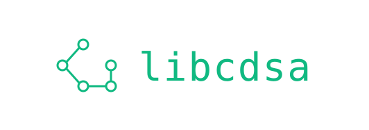

<p align="center"></p>

> [!WARNING]
> This library is currently a work in progress. It is experimental and may be unstable — use it at your own risk.

## Table of Contents

- [Overview](#overview)
  - [Features](#features)
  - [Limitations](#limitations)
  - [Technologies](#technologies)
- [Getting Started](#getting-started)
    - [Prerequisites](#prerequisites)
    - [Installing](#installing)
    - [Usage](#usage)
    - [Documentation](#documentation)
    - [Building](#building)
    - [Tests](#tests)
    - [Installing System-Wide](#installing-system-wide)
- [Frequently Asked Questions](#frequently-asked-questions)
- [License](#license)

## Overview

**A Feature-Rich, High-Level, and Easy-to-Use Data Structures and Algorithms Library for the C programming language.**

This project provides common data structures and algorithms with clean, expressive, and
reusable abstractions — bringing a modern programming experience to C.
It includes implementations of widely used data structures such as array lists, linked lists, hash maps, and hash sets,
along with classic algorithms like merge sort and quick sort. The API is heavily inspired by the 
Java Collections Framework, offering a familiar interface for developers with a Java background.

### Features

The library currently provides the following data structures:

- [Array List](src/list/array_list.h): A dynamic, linear structure that stores elements contiguously in memory for fast random access.
- [Linked List](src/list/linked_list.h): A dynamic, linear structure that stores elements in non-contiguous memory, linked by references.
- [Hash Map](src/map/hash_map.h): An unordered associative structure mapping unique keys to values using a hash function.
- [Tree Map](src/map/tree_map.h): An ordered associative structure mapping unique keys to values, backed by a binary search tree.
- [Hash Set](src/set/hash_set.h): An unordered structure storing unique elements with hash-based lookup.
- [Tree Set](src/set/tree_set.h): An ordered structure storing unique elements in a sorted manner, backed by a binary search tree.
- [Deque](src/deque/deque.h): A linear structure allowing insertion and removal at both ends of the sequence.
- [Stack](src/stack/stack.h): A linear LIFO structure where elements are inserted and removed from the top.
- [Queue](src/queue/queue.h): A linear FIFO structure where elements are added at the rear and removed from the front.
- [Priority Queue](src/priority_queue/priority_queue.h): A dynamic, linear structure that stores elements according to their priority in a queue.

There are also thin abstraction layers for list, map, and set types (compile-time dispatch):

- [List](src/list/list.h): A thin abstraction layer for `ArrayList` and `LinkedList`.
- [Map](src/map/map.h): A thin abstraction layer for `HashMap` and `TreeMap`.
- [Set](src/set/set.h): A thin abstraction layer for `HashSet` and `TreeSet`.

Also, there is some other utilities which may be useful:

- [Algorithms](src/util/algorithms.h): Algorithms related enumerations.
- [Collection](src/util/collection.h): Collection view abstraction.
- [Constraints](src/util/constraints.h): Pre-condition checks.
- [Errors](src/core/errors.h): Built-in custom error handling system used by the library.
- [For Each](src/util/for_each.h): For Each macro abstraction to iterate through collections.
- [Functions](src/util/functions.h): Functions typedefs and default implementations.
- [Pointer](src/util/pointer.h): Default functions for the library containers.
- [Iterator](src/util/iterator.h): Fully generic iterator abstraction.
- [Memory](src/core/memory.h): Memory management abstractions.
- [Optional](src/util/optional.h): Container type which may or may not contain a value.
- [Pair](src/util/pair.h): Container type which contains two values.
- [Sets](src/util/sets.h): Common mathematical set operations and set view abstraction.
- [String](src/core/string.h): Built-in custom string implementation.
- [Array](src/core/array.h): Built-in custom array implementation.
- [Types](src/core/types.h): Optioned type aliases.
- [Sequence](src/util/sequence.h): Declarative pipeline processing of collections.

### Limitations

Like any other project, there are some limitations (most by design):

- Lack of Type Safety.
- Reference Storage Only.
- Not Optimized for Peak Performance.
- Can cause Namespace Collision.
- Not Thread-Safe.
- It Mighty have some Bugs... (help find them!)

### Technologies

This project is being built using the following technologies:

- The C Programming Language
- CMake Build System
- Unity Test Framework

## Getting Started

There are several ways of adding the library to your project:

### Prerequisites

* C Compiler (C Standard 23)
* CMake Build Tool (Version 4.0)

### Installing

Add the library to your `CMakeLists.txt` and link it to your project:

```cmake
FetchContent_Declare(
        libcdsa
        GIT_REPOSITORY https://github.com/ayevexy/libcdsa.git
        GIT_TAG master # replace with the current version, e.g.: v1.0.0
)
FetchContent_MakeAvailable(libcdsa)

target_link_libraries(your_project PRIVATE libcdsa)
```

Instead, if installed system-wide:

```cmake
find_package(libcdsa REQUIRED)

target_link_libraries(your_project PRIVATE libcdsa::libcdsa)
```

The library is also distributed as a header/source pair files in [Releases](https://github.com/ayevexy/libcdsa/releases/latest). Just grab them:

```
your-project/
  libcdsa.h
  libcdsa.c
  main.c
```

### Usage

Simply include the headers you need (or the `libcdsa.h` master header) and start coding.
Don't forget to prefix includes with `libcdsa/` if installed system-wide.

The following examples demonstrate some of the library's features:

```c++
#include "list/list.h"
#include <stdio.h>

int main() {
    ArrayList* list = list_new(DEFAULT_ARRAY_LIST_OPTIONS());

    list_add_last(list, "Hello");
    list_add_last(list, "World!");
    
    const char* hello = list_get(list, 0);
    const char* world = list_get(list, 1);
    
    printf("%s %s\n", hello, world); // Hello World!

    list_destroy(&list);    
    return 0;
}
```

```c++
#include "map/map.h"
#include <stdio.h>

int main() {
    HashMap* map = map_new(DEFAULT_HASH_MAP_OPTIONS());

    map_put(map, "Hello", &(int){5});
    map_put(map, "World!", &(int){6});

    int* hello_length = map_get(map, "Hello");
    int* world_length = map_get(map, "World!");

    printf("Full length: %d\n", *hello_length + *world_length); // 11

    map_destroy(&map);
    return 0;
}
```

```c++
#include "set/set.h"
#include <stdio.h>

int main() {
    HashSet* set = set_new(DEFAULT_HASH_SET_OPTIONS());
    
    set_add(set, &(int){10});
    set_add(set, &(int){20});

    bool present = set_contains(set, &(int){30});
    printf("%s\n", present ? "true" : "false"); // false

    set_destroy(&set);
    return 0;
}
```

```c++
#include "list/list.h"
#include <stdio.h>

int main() {
    ArrayList* list = list_new(DEFAULT_ARRAY_LIST_OPTIONS());

    list_add_last(list, "Hello");
    list_add_last(list, "World!");

    Iterator* iter = list_iterator(list);

    while (iterator_has_next(iter)) {
        const char* string = iterator_next(iter);
        printf("%s ", string); // Hello World!
    }

    iterator_destroy(&iter);

    list_destroy(&list);
    return 0;
}
```

```c++
#include "list/list.h"
#include "util/for_each.h" // should be included last
#include <stdio.h>

int main() {
    ArrayList* list = list_new(DEFAULT_ARRAY_LIST_OPTIONS());

    list_add_last(list, "Hello");
    list_add_last(list, "World!");

    for_each (const char* string, list) {
        printf("%s ", string); // Hello World!
    }

    list_destroy(&list);
    return 0;
}
```

```c++
#include "list/list.h"
#include "util/sequence.h"
#include <stdio.h>

bool is_even(const void* number) {
    return *(int*) number % 2 == 0;
}

void add_one(void* number) {
    *(int*) number += 1;
}

void* replace_by_two_times(void* number) {
    return new(int, *(int*) number * 2);
}

int main() {
    ArrayList* list = list_new(DEFAULT_ARRAY_LIST_OPTIONS());

    list_add_last(list, &(int){1});
    list_add_last(list, &(int){2});
    list_add_last(list, &(int){3});
    list_add_last(list, &(int){4});
    list_add_last(list, &(int){5});

    Sequence* sequence = sequence_from(list_to_collection(list));

    sequence_filter(sequence, is_even); // 2, 4
    sequence_peek(sequence, add_one); // 3, 5
    sequence_map(sequence, replace_by_two_times); // 6, 10

    Array(void*) array = sequence_to_array(sequence);

    for (int i = 0; i < array_length(array); i++) {
        printf("%d ", *(int*) array[i]); // 6, 10
    }

    list_destroy(&list);
    array_destroy(&array);
    return 0;
}
```

```c++
#include "set/set.h"
#include "util/sets.h"
#include "util/for_each.h"
#include <stdio.h>

static inline uint64 int_hash(const void* number) {
    return *(int*) number * 0x9e3779b97f4a7c15ULL;
}

static bool int_pointer_value_equals(const void* a, const void* b) {
    return *(int*) a == *(int*) b;
}

static int int_pointer_value_compare(const void* a, const void* b) {
    return (*(int*) a > *(int*) b) - (*(int*) a < *(int*) b);
}

int main() {
    HashSet* set_a = set_new(DEFAULT_HASH_SET_OPTIONS(.hash = int_hash, .equals = int_pointer_value_equals));
    set_add(set_a, &(int){1});
    set_add(set_a, &(int){2});
    set_add(set_a, &(int){3});

    TreeSet* set_b = set_new(DEFAULT_TREE_SET_OPTIONS(.compare = int_pointer_value_compare));
    set_add(set_b, &(int){3});
    set_add(set_b, &(int){4});
    set_add(set_b, &(int){5});

    SetView union_set = sets_union(set_a, set_b); // 1, 2, 3, 4, 5
    SetView intersection_set = sets_intersection(set_a, set_b); // 3
    SetView difference_set = sets_difference(set_a, set_b); // 1, 2

    for_each (int* e, &union_set) printf("%d ", *e); // 1, 2, 3, 4, 5
    printf("\n");
    for_each (int* e, &intersection_set) printf("%d ", *e); // 3
    printf("\n");
    for_each (int* e, &difference_set) printf("%d ", *e); // 1, 2

    set_destroy(&set_a);
    set_destroy(&set_b);
    return 0;
}
```

```c++
#include "list/list.h"
#include <stdio.h>

int main() {
    ArrayList* list = list_new(DEFAULT_ARRAY_LIST_OPTIONS());

    list_add_last(list, "Hello");
    list_add_last(list, "World!");

    Collection collection = list_to_collection(list);

    LinkedList* other_list = list_new(DEFAULT_LINKED_LIST_OPTIONS());
    list_add_all_last(other_list, collection);

    const char* hello = list_get(other_list, 0);
    const char* world = list_get(other_list, 1);

    printf("%s %s\n", hello, world); // Hello World!

    list_destroy(&list);
    list_destroy(&other_list);
    
    return 0;
}
```

```c++
#include "core/errors.h"
#include <stdio.h>

int divide(int a, int b) {
    if (b == 0) {
        set_error(ARITHMETIC_ERROR, "Cannot divide by zero: %d / %d", a, b);
        return -1;
    }
    return a / b;
}

int main() {
    int result; Error error = attempt(result = divide(10, 0));

    if (error) {
        printf("An error occurred, continuing execution... details: %s\n", error_message());
    }

    divide(-1, 0); // ARITHMETIC_ERROR: Cannot divide by zero: -1 / 0

    printf("Unreachable");
    
    return 0;
}
```

```c++
#include "core/errors.h"
#include <stdio.h>

int divide(int a, int b) {
    if (b == 0) {
        set_error(ARITHMETIC_ERROR, "Cannot divide by zero: %d / %d", a, b);
        return -1;
    }
    return a / b;
}

int main() {
    Result(int) result = try(divide(10, 0));

    if (result.error) {
        printf("%s\n", error_message()); // ARITHMETIC_ERROR: Cannot divide by zero: 10 / 0
        return 1;
    }

    printf("result value: %d\n", result.value); // Unreachable
    
    return 0;
}
```

```c++
#include "core/array.h"
#include <stdio.h>

int main() {
    Array(int) array_a = array_new(5, int); // [ 0, 0, 0, 0, 0 ]
    Array(int) array_b = array_of(int, 1, 2, 3, 4, 5); // [ 1, 2, 3, 4, 5 ]

    int n = array_get(array_a, 0); // `int n = array_a[0];` also works
    printf("%d\n", n); // 0

    array_set(array_a, 0, 10); // `array_a[0] = 10;` also works

    for (int i = 0; i < array_length(array_a); i++) {
        printf("%d ", array_a[i]); // 10, 0, 0, 0, 0
    }
    
    printf("\n");

    for (int i = 0; i < array_length(array_b); i++) {
        printf("%d ", array_b[i]); // 1, 2, 3, 4, 5
    }

    array_destroy(&array_a);
    array_destroy(&array_b);
    
    return 0;
}
```

```c++
#include "core/string.h"
#include <stdio.h>

int main() {
    String hello = string_new("Hello"); // heap allocated
    String world = string_ref("World!"); // stack referenced

    char c = string_char_at(hello, 2);
    printf("%c\n", c); // l

    String sub = string_substring("literal", 0, 3);
    printf("%s\n", string_data(sub)); // lit

    // functions accepts both literals and string types
    String hello_world = string_join(" ", hello, world, "Code!");
    printf("%s\n", string_data(hello_world)); // Hello World! Code!

    Array(String) words = string_split(hello_world, ' ');
    for (int i = 0; i < array_length(words); i++) {
        printf("%s ", string_data(words[i])); // Hello World! Code!
    }

    string_destroy(&hello, &sub, &hello_world);
    array_destroy(&words);
    
    return 0;
}
```

```c++
#include "core/memory.h"
#include <stdio.h>

typedef struct {
    float x, y;
} Point;

int main() {
    int* number = new(int, 10);
    Point* point = new(Point, .x = 10, .y = 20);

    printf("%d\n", *number); // 10
    printf("x: %f, y: %f\n", point->x, point->y); // x: 10, y: 20

    delete(number);
    delete(point);
    
    return 0;
}
```

### Documentation

Each data structure and utility is documented in its corresponding header file within the `src` folder.
For usage examples, see the corresponding test file in the `test` folder.

### Building

If you want to build the project locally follow these steps instead:

Clone the project:

```bash
  git clone https://github.com/ayevexy/libcdsa.git
```

Go to the project directory:

```bash
  cd libcdsa
```

Build the project with CMake:

```bash
  mkdir build
  cmake -S . -B build
  cmake --build build
```

It will compile the library as a static library by default.
To compile it as a shared library instead, add the following flag:

```bash
  cmake -S . -B build -DBUILD_SHARED_LIBS=ON
```

### Tests

To run tests, execute the following command:

```bash
  ctest --test-dir build
```

### Installing System-Wide

To install the library system-wide in `/usr/local`, execute the following command:

```bash
  sudo cmake --install build
```

Instead, to install to a custom directory in the home folder:

```bash
  cmake --install build --prefix $HOME/my-libraries
```

## Frequently Asked Questions

- **Isn't it just another data structures library? Why does this exist?**

I made **libcdsa** as a hobby project to learn and practice the C programming language and data structures
and algorithms. But the project grew while developing it and became a powerful library with a different
and interesting design approach from most implementations.

- **What makes libcdsa different?**

Most implementations focus on simplicity and performance, at the cost of limited scope and heavy use of macros. **libcdsa** is
the opposite—its focus is mainly on functionality, an abstracted API, and ease of use. For example: the [Array List](src/list/array_list.h)
module has 50+ functions! The library also provides some flexibility regarding memory management by making it available but optional.
You can check the documentation to learn more about what this project can offer.

- **Isn't it a reimplementation of the Java Collections Framework, but in C?**

Even though **libcdsa** is heavily inspired by Java Collections, it's not a reimplementation.
The API is based on Java because I personally like it, but there are many differences, both in the API and in the implementation.
For example, Java makes heavy use of exceptions; however, in **libcdsa**, exceptions don’t exist—there’s an entirely new built-in error handling mechanism.
If you look at the source code and the API, the differences will become clear.

- **Is it easy to use?**

Absolutely. If you’ve used Java before, the API will feel familiar.
Even if you haven’t, the design is straightforward and consistent across all data structures.
The only tough part would be installing it, which requires CMake and some steps—unless you grab the header/source pair files instead.

- **Is it ready for production?**

If the mentioned [limitations](#limitations) aren’t an obstacle for your project, it might be used in production,
but it's better to wait until the first stable version is released. The project is currently in beta, and breaking changes may occur
before the definitive version `v1.0.0`.

- **Is it suitable for learning?**

One thing I tried to achieve and maintain while developing this project is the clarity and readability of the code.
But it can be difficult due to the size of the project, the topics it addresses, and some design decisions made.
Still, I think it could be a good source for learning.

- **Can I contribute with the project?**

Yes! If you have any feedback, feature requests, bug reports, or questions, you can start a discussion,
open an issue, or email me at `ayevexy@proton.me`. If you’ve used **libcdsa** anywhere, I’d love to know too!

## License

This project is licensed under the MIT License. See the [LICENSE](LICENSE) file for details.